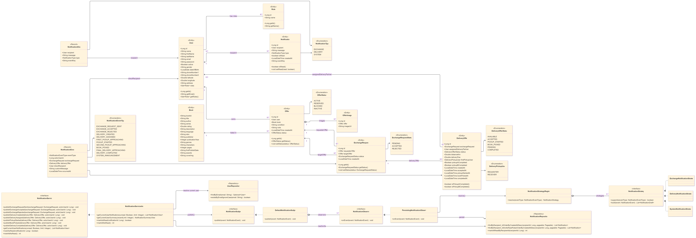
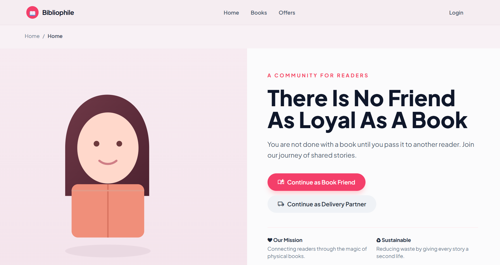
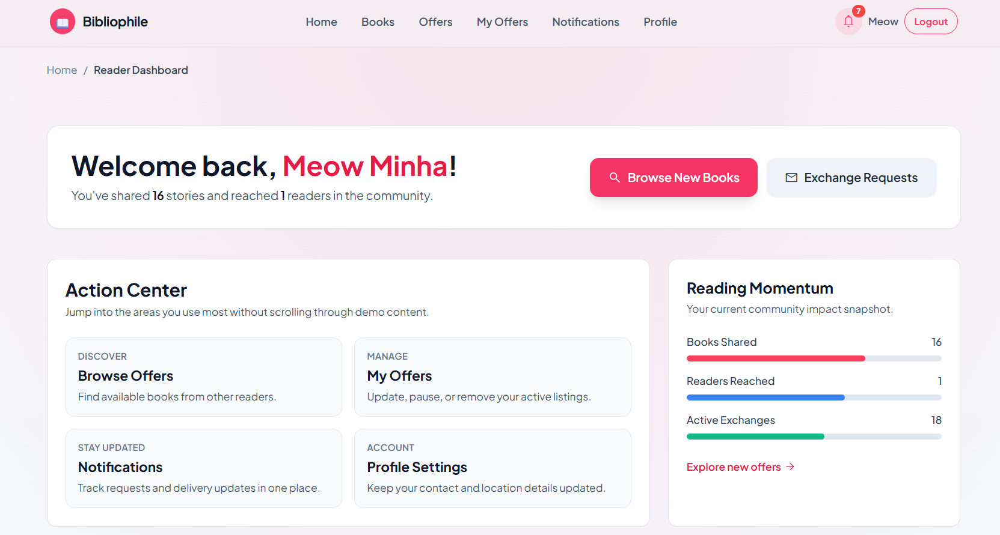
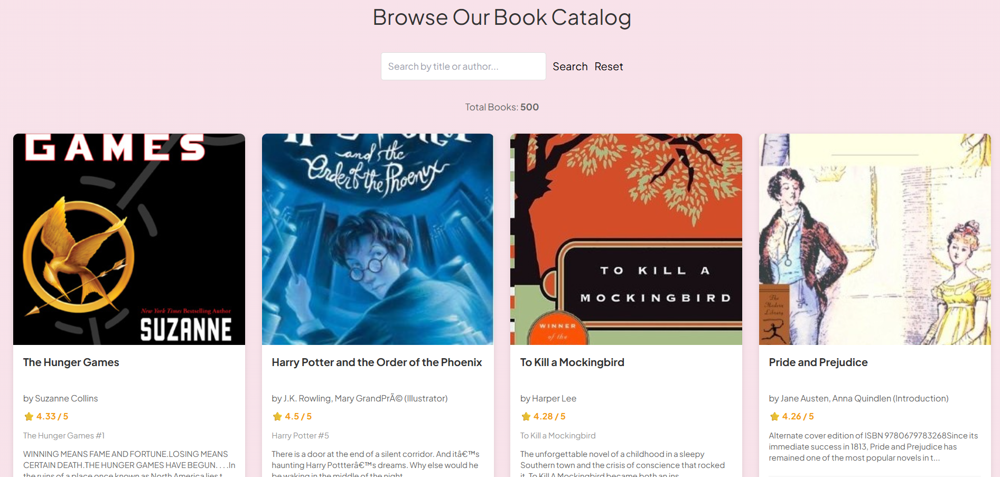

# Bookaroo

A location-aware community platform for exchanging physical books with trusted request, delivery, and completion workflows.

This README is fully restructured and repository-aligned. It reflects the current architecture, source modules, endpoints, workflows, and contribution history.

## Table of Contents

1. Project Title and Tagline
2. Executive Summary
3. Product Overview
4. Key Features (Grouped)
5. System Architecture
6. Technology Stack
7. Project Structure (Real)
8. Core Workflows
9. Diagrams
10. Screenshots
11. Demo and Walkthrough
12. Setup and Installation
13. Environment Variables
14. API Overview
15. Scalability and Design Decisions
16. Future Improvements and Roadmap
17. Contribution Guidelines
18. License

## 1. Project Title and Tagline

### Project Title
Bookaroo

### Tagline
A community-driven, role-aware platform that makes physical book exchange transparent, trackable, and operationally reliable.

## 2. Executive Summary

Bookaroo is a full-stack Spring Boot application for exchanging physical books within a local community. It supports three operational roles:
- Book friends (readers)
- Delivery partners
- Administrators

The platform covers the complete lifecycle:
- Discovery and listing of books/offers
- Exchange negotiation between users
- Delivery execution with route-aware pricing
- Event-driven user notifications
- Admin moderation for governance and safety

Why it matters:
- Informal book-sharing channels usually stop at discovery and fail at fulfillment.
- Bookaroo adds accountability through explicit state transitions and role-based operations.
- The codebase demonstrates production-grade engineering patterns: layered architecture, modular domains, deduped event handling, and automated CI checks.

## 3. Product Overview

### Real-World Problem
Readers often have reusable books but no reliable way to exchange them safely and efficiently. Existing options are fragmented and usually lack:
- Ownership-aware request handling
- Delivery coordination
- Role separation and moderation
- Status visibility across the transaction lifecycle

### Limitations of Typical Alternatives
Common listing solutions provide catalog discovery but not operational closure. They usually do not include:
- Multi-role lifecycle management
- Structured exchange acceptance and rejection rules
- Delivery progress management
- Notification infrastructure with read-state tracking

### How Bookaroo Solves It
Bookaroo integrates marketplace, exchange, delivery, and notifications in one coherent workflow:
1. Users sign up with role and location context.
2. Readers create offers for catalog books.
3. Exchange requests are initiated and resolved by offer owners.
4. Accepted exchanges generate delivery offers.
5. Delivery partners execute staged pickup and handoff actions.
6. Notifications update participants and maintain action visibility.

### High-Level Flow
- Discover books and offers
- Negotiate exchange
- Fulfill delivery lifecycle
- Track events and unread updates
- Moderate activity via admin controls

## 4. Key Features (Grouped)

### Core Features
- Role-aware authentication and dashboard routing for BOOK_FRIEND, DELIVERY_PARTNER, and ADMIN
- Book catalog loaded from CSV bootstrap data
- Offer creation, browse, update, delete, and image upload
- Exchange request lifecycle: create, accept, reject
- Personal request views for sent and received requests

### Advanced Features
- Delivery lifecycle with sequential operational checkpoints
- Route metric resolution with backend-calculated distance and delivery cost
- Interactive map support through Leaflet and route services
- Admin moderation actions for users, offers, books, and exchange requests
- Strong ownership and status guards before state transitions

### Intelligent and AI Features
- No AI or ML module is currently implemented.
- Decision logic is deterministic and rule-driven.

### System and Engineering Features
- Layered architecture: Controller -> Service -> Repository -> Entity
- Notification subsystem built with Observer and Strategy patterns
- Duplicate protection for exchange requests and notification events
- Spring Security with form login and JWT-based API login support
- CI pipeline on the dev branch with build and test execution

## 5. System Architecture

### Architecture Style
Bookaroo is implemented as a modular layered monolith with clear package boundaries:
- Presentation layer: Thymeleaf templates and page-specific JavaScript
- API layer: Spring MVC controllers (REST plus page routing)
- Domain layer: service logic and strategy/facade orchestration
- Persistence layer: Spring Data JPA with PostgreSQL

### Major Components and Responsibilities
- controller: auth, home, books, offers, exchange requests, delivery dashboard, reader profile
- admin: admin controller, facade, services, DTOs, and action strategies
- notification: event models, observer pipeline, strategy registry, repository, REST and page controllers
- security: custom user details, login success handler, JWT utility and filter
- service: user service, book service, delivery pricing service
- repository: fetch-optimized queries and lifecycle-specific lookups
- loader: CSV bootstrap for book data

### Data Flow
1. Frontend view or script sends request.
2. Security chain validates route and role access.
3. Controller validates payload and ownership constraints.
4. Services and repositories apply domain rules and persistence updates.
5. Domain actions publish notification events.
6. Observer resolves the correct notification strategy and persists drafts.
7. Navbar and notification pages poll summary/list endpoints.

### Delivery Lifecycle Design Note
Delivery transitions are intentionally modeled with both persisted and derived states:
- Persisted statuses in delivery_offers.status: AVAILABLE, PENDING, COMPLETED
- Derived operational states surfaced to clients: ACCEPTED, PICKUP_STARTED, BOOK_PICKED
- Pickup progression controlled by firstPickupUser, pickupACompleted, pickupBCompleted, and timestamps

### Architecture Placeholder


## 6. Technology Stack

| Category | Technologies |
|---|---|
| Frontend | Thymeleaf, Vanilla JavaScript, Tailwind CSS (CDN), Leaflet, Leaflet Control Geocoder |
| Backend | Java 17, Spring Boot 4.0.3, Spring MVC, Spring Security, Spring Data JPA, Jakarta Validation |
| Database | PostgreSQL (runtime), H2 (test profile) |
| DevOps and Delivery | Maven Wrapper, Docker multi-stage build, Docker Compose, GitHub Actions CI |
| Libraries | JJWT, Apache Commons CSV, Spring Security Test, MockMvc, Mockito |
| AI and ML | Not implemented |

## 7. Project Structure (Real)

```text
SEPM_PROJECT
|-- .github/
|   |-- workflows/
|       |-- ci.yml
|-- docs/
|   |-- ADMIN_TESTING_README.md
|   |-- auth-testing.md
|   |-- BOOK_OFFER_TESTING_REPORT.md
|   |-- DELIVERY_TESTS_README.md
|   |-- NOTIFICATION_SYSTEM_DOCUMENTATION.md
|   |-- project-prd.md
|   |-- diagrams/
|       |-- activity-diagram.mmd
|       |-- architecture-diagram.mmd
|       |-- class-diagram.mmd
|       |-- dfd.mmd
|       |-- use-case-diagram.mmd
|       |-- user-flow-diagram.mmd
|-- src/
|   |-- main/
|   |   |-- java/com/example/project/
|   |   |   |-- admin/
|   |   |   |-- config/
|   |   |   |-- controller/
|   |   |   |-- entity/
|   |   |   |-- loader/
|   |   |   |-- notification/
|   |   |   |-- repository/
|   |   |   |-- security/
|   |   |   |-- service/
|   |   |   |-- ProjectApplication.java
|   |   |-- resources/
|   |       |-- application.yaml
|   |       |-- books.csv
|   |       |-- static/
|   |       |   |-- js/
|   |       |   |-- styles/
|   |       |-- templates/
|   |           |-- error/
|   |           |-- fragments/
|   |-- test/
|       |-- java/com/example/project/
|       |   |-- admin/
|       |   |-- controller/
|       |   |-- notification/
|       |   |-- repository/
|       |   |-- service/
|       |-- resources/
|           |-- application-test.yaml
|-- uploads/
|   |-- offers/
|-- compose.yaml
|-- Dockerfile
|-- pom.xml
|-- mvnw
|-- mvnw.cmd
|-- .env
|-- .env.local
```

### Purpose of Major Directories
- docs: PRD, testing reports, and architecture diagrams
- src/main/java: backend business and infrastructure code
- src/main/resources/templates: server-rendered pages
- src/main/resources/static/js: frontend behavior per page
- src/test/java: unit, integration, and repository-level tests
- uploads: persisted offer images exposed by WebConfig

### Key Files and Responsibilities
- application.yaml: datasource, JPA, server port, admin bootstrap inputs
- SecurityConfig.java: URL authorization matrix and filter chain
- ExchangeRequestController.java: request lifecycle and delivery creation bridge
- DeliveryDashboardController.java: delivery state transitions and route synchronization
- NotificationServiceImpl.java: event publication and user-scoped read operations
- compose.yaml: PostgreSQL and app service orchestration
- Dockerfile: build and runtime images for application deployment

## 8. Core Workflows

### User Onboarding Workflow
1. User visits auth page and chooses role context.
2. Registration captures identity and profile location.
3. UserService resolves role aliases and persists user with encoded password.
4. Login success handler redirects to role-specific dashboard.

### Exchange and Delivery Workflow
1. Reader creates an active offer.
2. Another reader submits exchange request.
3. Target owner accepts or rejects request.
4. On acceptance:
   - Exchange status changes to ACCEPTED.
   - Both offers move to RESERVED.
   - Delivery offer is created if missing.
5. Delivery partner accepts delivery task.
6. First pickup is completed.
7. Second pickup and handoff is completed.
8. Final delivery completion is recorded.

### Backend Processing Workflow
- Repository layer uses fetch joins for detail-heavy pages.
- Delivery pricing service resolves normalized distance and cost.
- Lifecycle normalizer keeps old records compatible with new pickup flags.
- Admin action context dispatches strategy-based governance actions.

### Notification and Event Workflow
1. Domain action publishes NotificationEventType.
2. Notification subject distributes event to observers.
3. Persisting observer resolves matching strategy.
4. Strategy generates recipient-specific drafts and event keys.
5. Repository deduplicates and stores notifications.
6. Client polls summary and list endpoints; users mark one or all as read.

## 9. Diagrams




Source Mermaid files are maintained in docs/diagrams.

## 10. Screenshots

### Landing Page


### Dashboards


### Key Feature Interfaces



## 11. Demo and Walkthrough

- Demo video link: Add your video URL here

Suggested walkthrough sequence:
1. Register reader and delivery partner accounts.
2. Create offer and upload images.
3. Send and accept exchange request.
4. Accept and process delivery lifecycle actions.
5. Inspect notifications in navbar and notification center.
6. Show admin moderation actions and dashboard updates.

## 12. Setup and Installation

### Prerequisites
- Java 17
- Git
- Docker and Docker Compose (recommended)
- Internet access for map tile and routing services

### Installation Steps

#### Step 1: Clone the Repository
```bash
git clone <repository-url>
cd SEPM_PROJECT
```

#### Step 2: Configure Environment
Create or update .env in project root (example values):
```env
DB_NAME=se_project_db
DB_USER=se_project_user
DB_PASSWORD=securepass
DB_PORT=5432
DB_CONTAINER_NAME=se_project_db
APP_PORT=8080
APP_CONTAINER_NAME=se_project_app
SPRING_PROFILES_ACTIVE=dev
ADMIN_EMAIL=admin@example.com
ADMIN_PASSWORD=admin123
APP_JWT_SECRET=<base64-encoded-secret>
APP_JWT_EXPIRATION_MS=86400000
```

#### Step 3: Start Database
Option A (recommended): Docker Compose database service
```bash
docker compose up -d db
```

Option B: Use a local PostgreSQL instance and provide DB_URL, DB_USER, DB_PASSWORD.

#### Step 4: Run Application
Windows:
```powershell
.\mvnw.cmd spring-boot:run
```

Linux or macOS:
```bash
./mvnw spring-boot:run
```

#### Step 5: Access Application
- Home: http://localhost:8080
- Reader Dashboard: /reader/dashboard
- Delivery Dashboard: /delivery/dashboard
- Admin Dashboard: /admin/dashboard

### Running Full Stack with Docker Compose
```bash
docker compose up --build
```

### Build and Test Commands
Windows:
```powershell
.\mvnw.cmd clean package -DskipTests
.\mvnw.cmd test
```

Linux or macOS:
```bash
./mvnw clean package -DskipTests
./mvnw test
```

### Frontend Runtime Note
There is no separate frontend build pipeline in this repository. Templates and static assets are served directly by Spring Boot.

## 13. Environment Variables

| Variable | Required | Description |
|---|---|---|
| DB_URL | Optional | Full JDBC URL override; defaults to localhost PostgreSQL |
| DB_USER | Yes | Database username |
| DB_PASSWORD | Yes | Database password |
| DB_NAME | Yes for compose flow | PostgreSQL database name used by compose |
| DB_PORT | Yes for compose flow | Host to container PostgreSQL port mapping |
| DB_CONTAINER_NAME | Optional | Compose container name for database |
| APP_PORT | Optional | Spring server port and compose app port mapping |
| APP_CONTAINER_NAME | Optional | Compose container name for app |
| SPRING_PROFILES_ACTIVE | Optional | Active Spring profile (for example dev or test) |
| ADMIN_EMAIL | Recommended | Bootstrapped admin email read by AdminInitializer |
| ADMIN_PASSWORD | Recommended | Bootstrapped admin password read by AdminInitializer |
| APP_JWT_SECRET | Recommended in production | Base64 JWT signing secret used by JwtUtil |
| APP_JWT_EXPIRATION_MS | Optional | JWT expiration window in milliseconds |

## 14. API Overview

### Authentication
| Method | Endpoint | Purpose |
|---|---|---|
| POST | /api/auth/register | Register user via API |
| POST | /api/auth/login | Authenticate and return JWT token |
| POST | /api/auth/logout | Clear authentication context |

### Books
| Method | Endpoint | Purpose |
|---|---|---|
| GET | /books/browse | List catalog books |
| GET | /books/{id} | Get single book |
| POST | /books | Add new book (admin-only) |

### Offers
| Method | Endpoint | Purpose |
|---|---|---|
| GET | /offers | Browse active offers |
| GET | /offers/my-active | Current user active offers |
| GET | /offers/my | Current user offers with details |
| POST | /offers | Create offer |
| PUT | /offers/{offerId} | Update own offer |
| DELETE | /offers/{offerId} | Delete own offer |
| POST | /offers/{offerId}/images | Upload offer images |

### Exchange Requests
| Method | Endpoint | Purpose |
|---|---|---|
| POST | /exchange-requests | Create exchange request |
| PUT | /exchange-requests/{id}/accept | Accept request |
| PUT | /exchange-requests/{id}/reject | Reject request |
| GET | /exchange-requests/my-requests | Fetch sent and received requests |

### Delivery
| Method | Endpoint | Purpose |
|---|---|---|
| POST | /delivery/accept/{id} | Assign delivery offer to current partner |
| POST | /delivery/pickup-start/{id} | Complete first pickup |
| POST | /delivery/book-picked/{id} | Complete second pickup and handoff |
| POST | /delivery/complete/{id} | Complete final delivery |
| GET | /delivery/location/{id} | Delivery map view page |
| GET | /delivery/location-data/{id} | Delivery route and cost payload |

### Notifications
| Method | Endpoint | Purpose |
|---|---|---|
| GET | /notifications | List notifications (supports unread, limit) |
| GET | /notifications/summary | Unread count and recent notifications |
| PATCH | /notifications/{id} | Mark one notification as read |
| PATCH | /notifications | Mark all notifications as read |

### Admin
| Method | Endpoint | Purpose |
|---|---|---|
| GET | /admin/books | List books |
| POST | /admin/books | Create book |
| PUT | /admin/books/{id} | Update book |
| DELETE | /admin/books/{id} | Delete book |
| GET | /admin/offers | List offers |
| PUT | /admin/offers/{id}/block | Block offer |
| DELETE | /admin/offers/{id} | Delete offer |
| GET | /admin/users | List users |
| PUT | /admin/users/{id}/block | Block user |
| GET | /admin/exchange-requests | List exchange requests |
| PUT | /admin/exchange-requests/{id}/approve | Approve exchange request |

### Example Request Payloads

Login:
```http
POST /api/auth/login
Content-Type: application/json

{
  "email": "reader@example.com",
  "password": "secret123"
}
```

Create Exchange Request:
```http
POST /exchange-requests
Content-Type: application/json

{
  "requesterOfferId": 10,
  "targetOfferId": 24
}
```

Mark All Notifications Read:
```http
PATCH /notifications
```

## 15. Scalability and Design Decisions

### Why This Architecture
- A layered modular monolith was selected to preserve strong consistency across exchange and delivery transitions.
- It keeps deployment and debugging simple while still enforcing clear domain boundaries.
- Strategy and facade patterns reduce controller complexity and support controlled extensibility.

### Trade-offs
Benefits:
- Faster iteration and lower operational overhead
- Easier end-to-end tracing in one deployable runtime
- Strong transactional integrity for critical flows

Constraints:
- Independent horizontal scaling per module is limited
- Notification dispatch is currently in-process
- Uploaded media is local filesystem based

### Planned Scalability Path
- Move notifications to asynchronous broker-backed processing
- Migrate uploads to object storage
- Add caching for browse-heavy endpoints
- Introduce richer observability and telemetry

## 16. Future Improvements and Roadmap

- Add migration tooling (Flyway or Liquibase) for schema control
- Add OpenAPI contracts and API versioning
- Add rate limiting and abuse prevention on sensitive endpoints
- Add near-real-time updates with SSE or WebSocket
- Improve delivery partner assignment heuristics
- Introduce monitoring dashboards for SLA and throughput metrics

## 17. Contribution Guidelines

### How to Contribute
1. Fork repository.
2. Create a branch from dev.
3. Implement changes with tests.
4. Run local verification.
5. Open pull request to dev.

### Branching Strategy
- dev: integration branch
- feature/<topic>: new features
- fix/<topic>: bug fixes
- docs/<topic>: documentation changes

### Quality Expectations
- Keep business rules in service or strategy layers.
- Keep controller logic thin and explicit.
- Add or update tests for behavior changes.
- Maintain compatibility with existing frontend API contracts.
- Keep documentation synchronized with implementation changes.

### Team Contribution Highlights (Git History Based)

Contributor summary was derived from repository commit history up to April 4, 2026.

| Contributor | Key Impact Areas | Representative Contributions |
|---|---|---|
| Adiba Tahsin | Notification architecture, delivery lifecycle refinements, security and test improvements | Notification subsystem enhancements, delivery notification sequencing, auth and notification tests |
| Ayesha Mehereen and Mehereen-1 (same email identity) | Admin module, UI and templates, exchange and offer flow, testing and deployment polish | Admin action and dashboard workflows, UI fixes, books/offers/exchange test coverage |

### Verification Commands Used for Team Mapping
- git shortlog -sne --all
- git log --all --author=<email>
- file-area aggregation over git log --name-only

## 18. License

No explicit LICENSE file is currently present in this repository.

Until a license is added, treat this codebase as all rights reserved by default.

Recommended action:
1. Add a LICENSE file (for example MIT, Apache-2.0, or GPL-3.0).
2. Update this section to match the chosen license.
